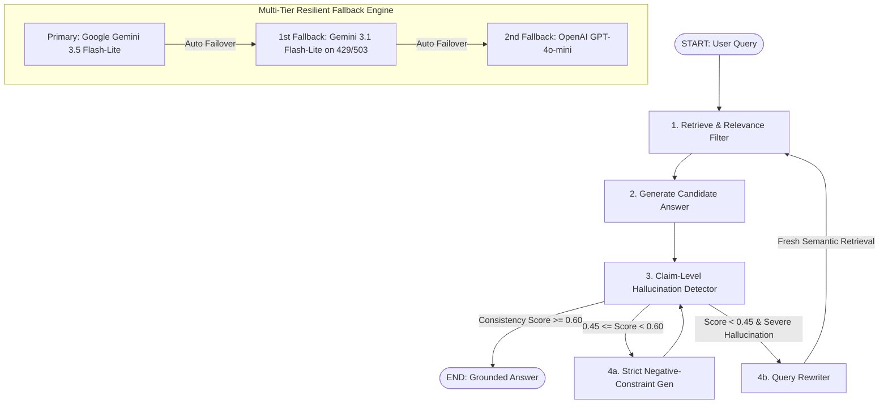

# Hallucination-Aware Agentic RAG System

A state-of-the-art **Self-Correcting Agentic Retrieval-Augmented Generation (RAG) System** built on **LangGraph**, **Google Gemini**, **HuggingFace**, and **ChromaDB**. The system features **multi-format document ingestion** (`.md`, `.txt`, `.pdf`, `.docx`), **context relevance filtering**, **claim-level hallucination evaluation**, and an **agentic dual-path correction loop** (constrained regeneration + automatic query rewriting).

---

## 1. Architecture Overview (LangGraph StateGraph)



---

## 2. System Components & Capabilities

### A. Universal Multi-Format Document Ingestion (`data/documents/`)
- Ingests **Markdown (`.md`)**, **Plain Text (`.txt`)**, **PDF (`.pdf`)**, and **Word (`.docx`)** documents.
- Automatically splits documents using `RecursiveCharacterTextSplitter` (Chunk Size: 800, Overlap: 100).
- Local CPU embeddings via HuggingFace `sentence-transformers/all-MiniLM-L6-v2` (384 dimensions) — **zero API cost**.
- Persisted vector storage via **ChromaDB** (`chroma_db/`).

### B. Context Relevance Filtering (Pruning Noise at the Source)
- Computes vector similarity distances for all retrieved chunks.
- Gated by `MIN_RELEVANCE_SCORE` (default `0.25`) to drop low-similarity noise before context reaches the LLM.
- Guaranteed fallback to top-$N$ chunks if all retrieved documents are filtered out.

### C. LangGraph StateGraph Agentic Pipeline (`src/rag_graph.py`)
- Declarative state machine managing full query state (`RAGGraphState`).
- Auditable execution traces recording nodes visited (`retrieve`, `generate`, `detect`, `strict_generate`, `rewrite_query`).

### D. Claim-Level Hallucination Detection (`src/hallucination_detector.py`)
- Deconstructs candidate answers into atomic factual claims.
- Cross-references each claim against the retrieved source chunks.
- Computes mathematical `consistency_score` ($0.0 \dots 1.0$) and returns detailed JSON diagnostics.

### E. Dual-Path Self-Correction Loop (CRAG / Self-RAG Inspired)
1. **Minor Hallucination ($0.45 \le \text{Score} < 0.60$):** Routes to `strict_generate` node with injected negative constraints.
2. **Severe Hallucination / Retrieval Mismatch ($\text{Score} < 0.45$):** Routes to `rewrite_query` node to reformulate the search query and perform fresh context retrieval.

### F. Multi-Tier Resilient Fallback Engine (`src/config.py`)
- Primary: `gemini-3.5-flash-lite` (Sub-2s inference, 250k TPM headroom).
- Seamless auto-failover to `gemini-3.1-flash-lite` on rate limits or service degradation, followed by `gpt-4o-mini`.

---

## 3. Project Directory Structure

```
RAG-Hallucination/
│
├── data/documents/             # Knowledge base source documents (.md, .txt, .pdf, .docx)
├── chroma_db/                  # Local ChromaDB vector database index
├── outputs/                    # JSON execution traces & evaluation reports
├── tests/                      # Pytest unit & integration test suite (20 tests)
│   └── test_hallucination_detector.py
│
├── src/
│   ├── config.py               # Central config, models, fallback engine & prompts
│   ├── create_database.py      # Multi-format document ingestion & ChromaDB builder
│   ├── rag_graph.py            # LangGraph StateGraph agentic workflow & routing
│   ├── rag_engine.py           # Core HallucinationAwareRAG engine & CLI API
│   ├── hallucination_detector.py # Claim extraction & JSON consistency evaluator
│   ├── query_rag.py            # CLI query runner, demo mode & interactive chat
│   └── evaluate.py             # 8-category benchmark & evaluation suite
│
├── check_models.py             # Model diagnostic & latency benchmark tool
├── run.py                      # One-stop CLI entry point
├── requirements.txt            # Python dependencies (LangGraph, PyPDF, Docx2txt, etc.)
├── .env.example                # Template for API keys and configurations
└── README.md                   # System documentation
```

---

## 4. Configuration & Key Parameters

Configured in [src/config.py](file:///d:/PROJECTS/RAG-Hallucination/src/config.py) and customizable via `.env`:

| Parameter | Default | Purpose |
| :--- | :--- | :--- |
| `LLM_PROVIDER` | `gemini` | Primary engine (`gemini`, `openai`, or `auto`) |
| `LLM_MODEL` | `gemini-3.5-flash-lite` | Primary LLM model identifier |
| `HALLUCINATION_THRESHOLD` | `0.6` | Consistency score required to accept answer |
| `STRICT_MODE_THRESHOLD` | `0.4` | Score below which strict mode constraints activate |
| `QUERY_REWRITE_THRESHOLD` | `0.45` | Score below which query rewriting & re-retrieval activates |
| `MIN_RELEVANCE_SCORE` | `0.25` | Minimum vector similarity threshold for context filtering |
| `MIN_CHUNKS_REQUIRED` | `1` | Fallback chunk count if all chunks are filtered out |
| `MAX_REGENERATION_ATTEMPTS` | `3` | Maximum self-correction iterations per query |
| `CHUNK_SIZE` / `CHUNK_OVERLAP` | `800` / `100` | Document chunking dimensions |
| `TOP_K_RESULTS` | `5` | Number of context chunks retrieved per query |

---

## 6. Quick Start Guide

### 1. Environment Setup
```powershell
# Create & activate virtual environment
python -m venv venv
.\venv\Scripts\Activate.ps1

# Install dependencies
pip install -r requirements.txt
```

### 2. Configure API Keys
Copy `.env.example` to `.env` and provide your Google Gemini API key (free tier available at [Google AI Studio](https://aistudio.google.com/app/apikey)):
```env
LLM_PROVIDER=gemini
GEMINI_API_KEY=your_gemini_api_key_here
OPENAI_API_KEY=your_openai_api_key_here  # Optional secondary fallback
```

### 3. Initialize Database
```powershell
python run.py setup
```

### 4. Usage Modes
- **Single Query:**
  ```powershell
  python run.py query "What is Retrieval-Augmented Generation?"
  ```
- **Interactive Chat Session:**
  ```powershell
  python run.py interactive
  ```
- **Built-in Demo Questions:**
  ```powershell
  python run.py demo
  ```
- **Full Benchmark Evaluation Suite:**
  ```powershell
  python run.py evaluate
  ```
- **Unit Tests:**
  ```powershell
  python run.py test
  ```
- **Model Diagnostics:**
  ```powershell
  python check_models.py
  ```
