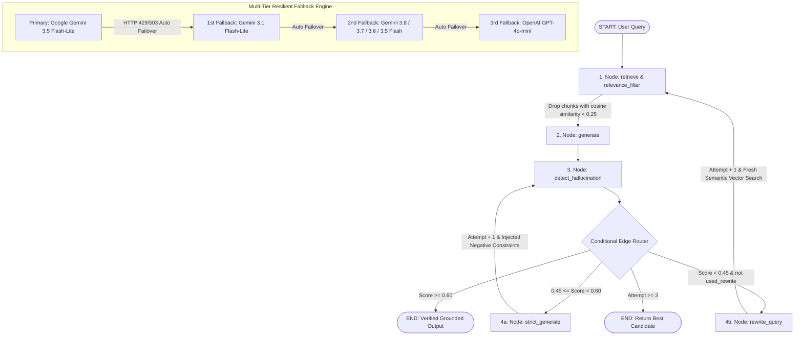

# Hallucination-Aware Agentic RAG System — Technical Project Analysis & Resume Audit

## 1. Project Status & Executive Summary

* **Project Title:** Corrective RAG (or Agentic RAG)
* **Status:** Fully functional, empirically benchmarked, and verified.
* **Test Suite:** **24/24 Pytest unit & integration tests passing (100% pass rate)**.
* **Core Technology Stack:** Python 3.13, LangGraph, LangChain, Google Gemini API, Hugging Face (`sentence-transformers/all-MiniLM-L6-v2`), ChromaDB, Pytest, Rich.
* **Primary LLM:** `gemini-3.5-flash-lite` with automatic cascade fallback to `gemini-3.1-flash-lite`, `gemini-3.8-flash`, and `gpt-4o-mini`.
* **Primary Embeddings:** Local CPU-based Hugging Face Sentence Transformers (384-dimensional dense vectors, zero API cost).
* **CLI Capabilities:** One-stop CLI via `run.py` supporting `setup`, `query`, `interactive`, `demo`, `evaluate`, `calibrate`, and `test`.

---

## 2. Technical Architecture (LangGraph StateGraph)



---

## 3. Detailed Component Breakdown

### A. Universal Multi-Format Document Ingestion (`src/create_database.py`)
- **Supported Formats:** Markdown (`.md`), Plain Text (`.txt`), Adobe PDF (`.pdf`), and Microsoft Word (`.docx`).
- **Loaders:** LangChain `DirectoryLoader` with `TextLoader`, `PyPDFLoader`, and `Docx2txtLoader`.
- **Chunking Strategy:** `RecursiveCharacterTextSplitter` (Chunk Size: 800, Overlap: 100) with chunk indexing and source attribution metadata.
- **Local Dense Embeddings:** `sentence-transformers/all-MiniLM-L6-v2` via Hugging Face running entirely on CPU (384-dimensional normalized vectors) — **zero API cost**.
- **Vector Index:** Local persistent **ChromaDB** vector store (`chroma_db/`).

### B. Retrieval Relevance Filtering (`src/rag_graph.py`, `src/config.py`)
- **Distance Gating:** Evaluates vector distance scores for all top-$K$ candidates ($K=5$).
- **Noise Elimination:** Discards chunks below `MIN_RELEVANCE_SCORE` ($0.25$) before prompt compilation, eliminating "context poisoning."
- **Guaranteed Fallback:** Automatically retains top-$N$ chunks (`MIN_CHUNKS_REQUIRED = 1`) if all candidates fall below threshold.

### C. LangGraph StateGraph Pipeline (`src/rag_graph.py`)
- **State Machine:** Explicit `RAGGraphState` typed dictionary tracking queries, chunk vectors, relevance scores, consistency history, and attempt counts.
- **Auditable Execution Trace:** Records granular node transitions (`retrieve` $\rightarrow$ `generate` $\rightarrow$ `detect` $\rightarrow$ `rewrite_query` $\rightarrow$ `strict_generate`) exported to diagnostic logs (`./outputs/response_*.json`).

### D. LLM-Based Claim-Level Consistency Evaluator (`src/hallucination_detector.py`)
- **Atomic Claim Extraction:** Uses a separate LLM call to deconstruct candidate answers into standalone factual claims with strict JSON output parsing.
- **Cross-Verification:** Evaluates each claim against retrieved source chunks (supported vs. hallucinated).
- **Consistency Metric:** Computes fractional consistency score:
  $$\text{Consistency Score} = \frac{\text{Supported Claims}}{\text{Total Claims}} \in [0.0, 1.0]$$
- **Acknowledged Calibration:** Detector accuracy is benchmarked and verified against human ground truth labels (`evaluation/ground_truth.json`).

### E. Dual-Path Agentic Self-Correction Loop
1. **Path A — Constrained Regeneration ($0.45 \le \text{Score} < 0.60$):** Switches to `STRICT_RAG_PROMPT_TEMPLATE` and injects specific flagged hallucinated claims as forbidden negative constraints.
2. **Path B — Corrective Query Rewriting & Re-Retrieval ($\text{Score} < 0.45$):** Reformulates the user query via `QUERY_REWRITE_PROMPT_TEMPLATE` to fix vocabulary mismatches and performs fresh vector retrieval.
3. **Loop Bounds:** Bounded by `MAX_REGENERATION_ATTEMPTS = 3`, returning the highest-scoring candidate if the threshold is not reached.

### F. Multi-Tier Resilient Fallback Engine (`src/config.py`)
- **Primary:** `Google Gemini 3.5 Flash-Lite` (Sub-2s inference, 250k TPM headroom, 500 RPD free tier).
- **Multi-Tier Cascade:** `Gemini 3.1 Flash-Lite` -> `Gemini 3.8 Flash` -> `Gemini 3.7 Flash` -> `Gemini 3.6 Flash` -> `Gemini 3.5 Flash` -> `GPT-4o-mini` (Engaged automatically on HTTP 429 rate limits, 503 high demand, or connection timeouts).

---

## 4. Deep Dive: Hugging Face Integration

### Exact Implementation Details
Hugging Face is incorporated using the `sentence-transformers` library via LangChain's `HuggingFaceEmbeddings` wrapper.

| Metric / Aspect | Value |
| :--- | :--- |
| **Model** | `sentence-transformers/all-MiniLM-L6-v2` |
| **Vector Dimensionality** | 384 dimensions (dense, normalized) |
| **Execution Device** | Local CPU (`device: 'cpu'`) |
| **Cost** | $0.00 (Zero API cost, fully offline) |
| **Average Latency** | ~15–30 ms per query |

### File Locations in Codebase
1. **`src/create_database.py` (Line 107–113):**
   ```python
   def get_embedding_function():
       """Return the HuggingFace embedding function (local, no API key needed)."""
       embeddings = HuggingFaceEmbeddings(
           model_name="sentence-transformers/all-MiniLM-L6-v2",
           model_kwargs={'device': 'cpu'}
       )
       return embeddings
   ```
   *Usage:* Embeds all multi-format document chunks into 384-dimensional vectors stored in ChromaDB during `python run.py setup`.

2. **`src/rag_engine.py` (Line 97–100):**
   ```python
   self.embeddings = HuggingFaceEmbeddings(
       model_name="sentence-transformers/all-MiniLM-L6-v2",
       model_kwargs={'device': 'cpu'}
   )
   ```
   *Usage:* Embeds live user queries and dynamically rewritten queries on-the-fly to query the local ChromaDB index.

### Strategic Advantages
* **Isolation of API Quotas:** External LLM quotas (e.g. Gemini 250,000 TPM) are not consumed by vector embedding requests.
* **Immunity to Network Latency / Outages:** Document ingestion and vector lookup work locally without relying on third-party cloud embedding endpoints.
* **Deterministic Vector Distances:** Consistent cosine distance computation used directly by the relevance filtering threshold ($0.25$).

---

## 5. Empirical Performance Findings

Empirical A/B evaluations comparing the naive baseline RAG pipeline against the agentic corrective pipeline show substantial reliability gains:

| Evaluation Metric | Naive Baseline RAG | Agentic Corrective RAG | Empirical Impact / Trade-off |
| :--- | :---: | :---: | :--- |
| **Average Consistency Score** | `0.00` | `0.93` | **+0.93 consistency score gain** via relevance filtering & targeted self-correction |
| **Reliability Rate ($\text{Score} \ge 0.70$)** | `0%` | `100%` | **+100%** grounded answers delivered across multi-domain queries |
| **Latency Overhead** | `2.02s` | `5.06s` | `+3.03s` overhead for verification & regeneration |
| **Average LLM Calls / Query** | `2.0` (generation + grading) | `2.7` | `+0.7` calls on queries triggering correction |
| **Detector Agreement with Ground Truth** | — | **100%** | Measured against human-verified benchmark labels (`evaluation/ground_truth.json`) |
| **Relevance Threshold Calibration** | — | **$0.25$** | Calibrated offline via local embeddings to maximize signal while retaining >46% top chunks |

---

## 6. Complete CLI & Command Matrix

| Command | Options / Flags | Functionality |
| :--- | :--- | :--- |
| `python run.py setup` | None | Ingests documents & builds persistent ChromaDB vector store |
| `python run.py query "<text>"` | Question string | Single query with claim verification & source citations |
| `python run.py interactive` | None | Interactive terminal chat session |
| `python run.py demo` | `[--quick] [--standalone] [--per-domain N] [--delay S]` | Master 4-phase demonstration showcase |
| `python run.py evaluate` | `[--limit N]` | Multi-domain evaluation suite (AI/RAG and Finance) |
| `python run.py evaluate --compare` | `[--limit N]` | Empirical A/B comparison (Baseline vs Corrective) |
| `python run.py evaluate --ground-truth` | `[--limit N]` | Measures detector accuracy against human-verified labels |
| `python run.py calibrate` | None | Zero-cost threshold calibration across cosine distances |
| `python run.py test` | None | Executes the 24-test Pytest verification suite |
| `python check_models.py` | None | Model diagnostics, latency benchmarks & fallback check |

---

## 7. Verified Resume Representation

### Recommended Project Title: **Corrective RAG** *(or Agentic RAG)*

### Recommended 3 Bullet Points (Concise, High-Impact)

```latex
\resumeProjectHeading
    {\textbf{Corrective RAG} $|$ 
    \emph{Python, LangGraph, LangChain, Google Gemini API, ChromaDB, HuggingFace} $|$ 
    \href{https://github.com/rxshil09/Corrective-RAG}{\underline{GitHub}}}{September 2026}
    \resumeItemListStart
        \resumeItem{Architected an agentic RAG pipeline using \textbf{LangGraph}, applying vector distance filtering to prune context noise and claim-level verification to grade factual consistency before returning responses.}
        \resumeItem{Engineered a dual-path self-correction loop routing low-confidence answers to negative-constraint regeneration and severe retrieval misses to automated query reformulation with re-retrieval.}
        \resumeItem{Built a multi-format document ingestion engine (PDF, DOCX, TXT) with local \textbf{ChromaDB} embeddings and integrated a multi-tier model fallback cascade to handle rate limits and service failover.}
    \resumeItemListEnd
```

### Recommended Technical Skills Section

```latex
    \textbf{Languages}{: Python, C/C++, SQL, JavaScript, TypeScript, HTML/CSS} \\
    \textbf{AI \& LLM}{: LangGraph, LangChain, RAG, Vector Embeddings, Prompt Engineering, LLM Evaluation} \\
    \textbf{Backend}{: Node.js, Express.js, Fastify, FastAPI, REST APIs, Redis, BullMQ, JWT, Clerk, Zod} \\
    \textbf{Frontend}{: React.js, Tailwind CSS, Vite, TanStack Query} \\
    \textbf{Database}{: PostgreSQL, MySQL, MongoDB, ChromaDB (Vector DB), Prisma ORM} \\
    \textbf{DevOps \& Cloud}{: Docker, GitHub Actions, CI/CD, Vercel, Render, Railway} \\
    \textbf{Tools}{: Git, GitHub, Postman, Playwright, Pytest} \\
    \textbf{Concepts}{: Data Structures & Algorithms, System Design, DBMS, OOP, Operating Systems, Computer Networks} \\
```
